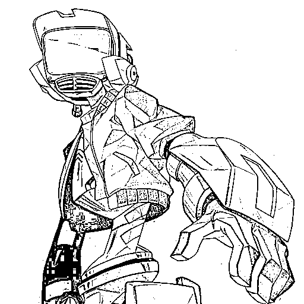
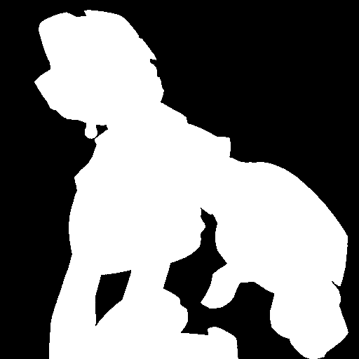
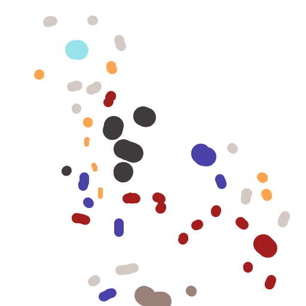
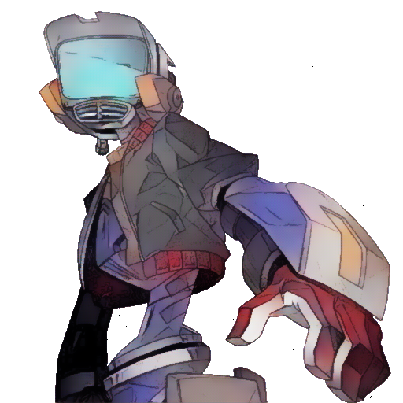
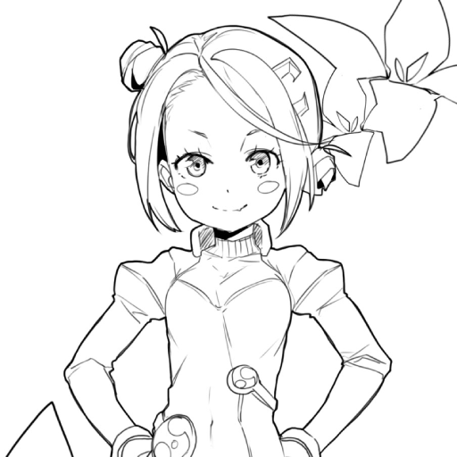
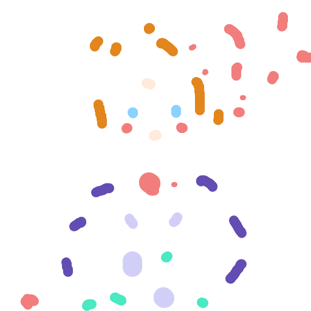
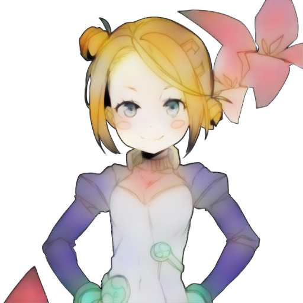

# PaintsTorch2

    

    
    
    
    

    
    
    
    

## Authors

- Yliess HATI - [Github](https://github.com/yliess86)
- Vincent THEVENIN - [Github](https://github.com/vincent-thevenin)
- Grégor JOUET - [Github](https://github.com/WIN32GG)

## Bibliography

- [GAN Improvements](https://arxiv.org/pdf/1710.10196.pdf) - Progressive Growing of GANS for Improved Quality, Stability, and Variation - Karras and al. - *ICLR 2018*
- [AlacGAN](https://arxiv.org/pdf/1808.03240.pdf) - User-Guided Deep Anime Line Art Colorization with Conditional Adversarial Networks - Ci and al. - *ACM MM 2018* - [Code](https://github.com/orashi/AlacGAN)
- [PaintsTorch](https://dl.acm.org/doi/abs/10.1145/3359998.3369401) - PaintsTorch: a User-Guided Anime Line Art Colorization Tool with Double Generator Conditional Adversarial Network - Hati, Jouet and al. - *CVMP 2019* - [Code](https://github.com/yliess86/PaintsTorch)